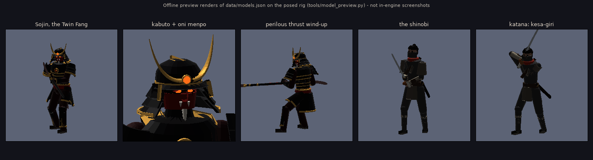

# Dankiro

A Sekiro-inspired boss fight prototype for **Godot 4.7** (Forward+).
One arena, one duel: you (a shinobi with a katana) against **Sojin, the Twin Fang**, an
armoured warrior with a staff that has a curved blade on each end.



*Offline preview renders of the character data (`tools/model_preview.py`), not in-engine screenshots.*

## Running it

1. Install Godot **4.7** (standard build; no C# needed).
2. Open `project.godot` in the editor. The first open imports the audio, textures and font.
3. Press **F5**.

Everything (characters, weapons, arena, effects, HUD) is built from code and data at runtime,
so `scenes/main.tscn` is just a root node with `scripts/main.gd`.

## Controls

| Action | Keyboard / mouse | Gamepad |
| --- | --- | --- |
| Move | WASD | Left stick |
| Camera | Mouse | Right stick |
| Attack | Left mouse / J | RB |
| Guard / Deflect | Right mouse / K | LB |
| Dodge (hold to sprint) | Shift | B |
| Jump | Space | A |
| Lock on | Q / middle mouse | R3 |
| Heal (gourd, 3 uses) | R | X |
| Pause (shows controls) | Esc | Start |
| Controls panel | F1 | Back |
| Timing debug readout | F3 | |
| Fullscreen | F11 | |

The input map is registered in code (`scripts/autoload/game_input.gd`); actions you add in
*Project Settings > Input Map* are kept.

## Combat

### Deflecting

- Pressing guard opens a **0.200 s deflect window** (12 frames at 60 fps, as in Sekiro). If a
  blade touches you inside the window, you deflect: bright sparks, a star flash, a light pulse,
  a ringing "ting", a ~75 ms hit-stop, a small shove, controller rumble, and posture damage to
  the boss. A deflect can never break your own posture.
- **Mashing is penalised.** A press within 0.45 s of the previous one (without a deflect in
  between) shrinks the next window: 200, 133, 100, 83, 67 ms. **A successful deflect resets
  it**, so deflecting a combo in rhythm works but blind mashing doesn't.
- **Holding** guard past the window only **blocks**: dull clank, no vitality damage, a big chunk
  of *your* posture. Fill your posture while blocking and your guard breaks.
- A tapped guard stays up for 0.23 s (longer than the widest window), so tap-deflects work.
- Timing is measured precisely. Physics runs at 120 Hz with agile input flushing. Presses are
  stamped with sub-tick game time, and blade contact time is found by a swept blade-versus-capsule
  test (`Combat.blade_vs_capsule`), so the window isn't rounded to frames. Press **F3** to see how
  many milliseconds before contact you pressed, and whether you were early or late.

### Perilous attacks (危)

The kanji flashes red above him with a deep warning sound and his blades glow hot.

- **Perilous thrust:** step (dodge) **toward** him as he lunges to perform a **Mikiri Counter**.
  You stomp the blade and deal heavy posture damage. You can also deflect it. Blocking fails.
- **Perilous sweep:** a low, full 360° spin. **Jump** over it; dodge i-frames don't save you.
  While airborne near him, press **jump again** to kick off him, which deals posture damage and
  staggers him out of the sweep. You can follow up with an air attack.

### Posture and the deathblow

- Deflects, mikiri counters, kicks and hits all build his posture. So do attacks he blocks.
- His posture recovers when you ease off, and it recovers more slowly as his vitality drops.
  Hitting him makes the posture war easier.
- When his posture breaks (or his vitality empties), he drops to one knee under a red mark.
  Press **Attack** close to him to perform a **deathblow**.
- He has **two lives**. After the first deathblow he rises into phase two: faster, more
  aggressive, and with more parries.

### His behaviour

- He guards most attacks from neutral and often strikes right after you stop hitting his guard.
- Keep attacking into his guard and he **parries** you, knocking your sword away, then counters.
- He punishes healing at range with thrusts and leaping cleaves.
- His attack strings end in mix-ups: combo → combo → *(delayed overhead | perilous thrust | perilous sweep)*.

| Attack | Tell | Answer |
| --- | --- | --- |
| Rising Fang → Turning Fang → Heaven's Fall | Coils right, low blade trails behind | Deflect each hit. The overhead finisher is **delayed**, so wait for it. |
| Fang Jabs | Draws the staff back at the hip (no kanji) | Deflect twice. Mikiri doesn't work on these. |
| Perilous Thrust 危 | Turns side-on, crouches, aims the blade at you | Mikiri (step toward him) or deflect |
| Perilous Sweep 危 | Sinks low, staff held low on his left | Jump, then kick |
| Whirling Fangs | Spins the staff like a windmill at his side | Deflect the rhythm (4 hits), then the finishing cut |
| Falling Crescent | Crouches at range, leaps with the staff overhead | Deflect on landing (high) |
| Parry Counter | Deflects your attack | Guard right away |

## Project layout

```
project.godot              Godot 4.7, Forward+, 120 Hz physics, agile input flushing
scenes/main.tscn           root node -> scripts/main.gd (builds and runs the fight)
scripts/
  autoload/                GameInput (input map), Game (clock, hit-stop, shake), Sfx (audio)
  anim/                    PoseAnimator, ClipData, HumanoidRig (FK + two-bone IK), PoseMath
  rig/                     MeshKit (procedural meshes), ModelBuilder, SpringChain (cloth/hair)
  characters/              Combatant (base), Player, Boss (+ AI)
  combat/combat.gd         all tuning constants + hit geometry
  fx/                      sparks / flashes / blood / dust / kanji, weapon trails
  camera/, ui/, world/     lock-on camera, HUD + overlays, arena
shaders/                   night sky, procedural flagstone floor
data/                      rigs.json, animations.json, models.json (generated, see below)
audio/, textures/, fonts/  generated sound effects, brush kanji, UI font (OFL)
tools/                     Python content pipeline + previewers (ignored by Godot)
```

## Content pipeline (Python)

Animations, models, sounds and kanji are generated by scripts, so they're easy to tweak.
You need Python 3.10+ with `numpy scipy matplotlib pillow fonttools`.

| What | Edit | Rebuild | Check |
| --- | --- | --- | --- |
| Animations + hit windows | `tools/build_animations.py` | `python3 tools/build_animations.py` | `python3 tools/anim_preview.py b_thrust` renders contact sheets, and `--all --check` reports IK reach and blade reach |
| Character looks | `tools/build_models.py` | `python3 tools/build_models.py` | `python3 tools/model_preview.py boss --zoom head` |
| Sound effects | `tools/gen_audio.py` | `python3 tools/gen_audio.py [name]` | |
| Kanji + UI font | `tools/gen_textures.py` | `python3 tools/gen_textures.py` | |
| GDScript sanity | | | `python3 tools/check_gdscript.py` cross-checks member and function names and call arity across the scripts |

How the animation system works:

- Each pose is a set of channels: hips position/rotation, spine and chest, foot targets, and the
  **weapon transform**. Legs use two-bone IK and hands grip the animated weapon with IK, which
  keeps two-handed staff swings coherent.
- Keys are interpolated with monotone cubic curves. Clips carry the gameplay metadata: hit
  windows (`hits`), boss tracking rates (`track`), recovery openings (`vuln`), combo and cancel
  windows, i-frames and the mikiri window.
- `tools/rigmath.py` mirrors the GDScript solver exactly, so the previews match the game.

## Tuning

- `scripts/combat/combat.gd` holds the deflect windows, spam penalty, hit-stop lengths, HP,
  posture and regen values, and mikiri and kick posture damage.
- `scripts/characters/boss.gd` holds `SEQUENCES`, his attack strings: the options at each step,
  the chance to continue, distance ranges and weights.
- Per-attack damage and posture numbers are in the `hits` entries in `tools/build_animations.py`.

## Status

This first milestone was written **without being able to launch Godot**: the build environment's
network policy blocked the Godot download. What *was* verified:

- Every GDScript file parses (gdtoolkit).
- Every `:=` type inference was checked by a static scan.
- Each animation was rendered and checked for IK reach and blade reach with the Python mirror.
- Character meshes were rendered offline, and backface culling confirmed the triangle winding.
- The sounds were inspected as spectrograms.

The first run in the editor may still turn up small script errors. Please report anything
you see in the Output panel. Balance values are first-pass guesses meant for playtesting.

Ideas for next steps: more attacks (grab 危), a third phase, a proper arena prop pass, music,
camera polish and a settings menu.

## Credits

- Fonts: *Cormorant Garamond* (UI) and *Yuji Boku* (used to render the kanji textures).
  Both are SIL Open Font License 1.1, and the license texts are in `fonts/` and `textures/`.
- Everything else (code, meshes, animations, sounds, shaders) was made for this project.
