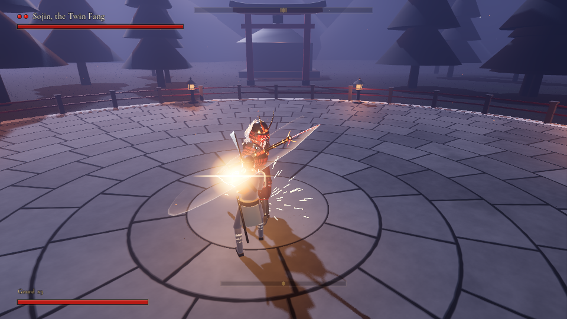

# Dankiro

A Sekiro-inspired boss fight prototype for **Godot 4.7** (Forward+, tested on 4.7.2).
One arena, one duel: you (a shinobi with a katana) against **Sojin, the Twin Fang**, an
armoured warrior with a 3.2 m staff that has a curved blade on each end.

The combat is tuned against a written spec of how Sekiro actually works:
[docs/SEKIRO_MECHANICS.md](docs/SEKIRO_MECHANICS.md). An automated combat lab checks the game
against it (see [Testing](#testing)).



*In-engine (Godot 4.7.2, rendered with Movie Maker): a perfect deflect of his Rising Fang.
The boss up close: [docs/boss_model.png](docs/boss_model.png), and
[before and after](docs/boss_before_after.png) his PS2-style model.*

## Running it

1. Install Godot **4.7** (standard build, no C# needed; 4.7.2 is what it's tested on).
2. Open `project.godot` in the editor. The first open imports the audio, textures and font.
3. Press **F5**. The game opens on the title menu: **Start fight**, **Options**, **Controls**
   and **Quit**. Use the mouse, or the arrows and Enter, or a gamepad (D-pad or left stick,
   A to select, B to go back).

Everything is generated from code: the arena, effects, HUD and the player are built at
runtime, and the boss is a skinned model that a script builds with Blender (see
[Content pipeline](#content-pipeline-python)). `scenes/main.tscn` is just a root node with
`scripts/main.gd`.

## Controls

| Action | Keyboard / mouse | Gamepad |
| --- | --- | --- |
| Move | WASD | Left stick |
| Camera | Mouse | Right stick |
| Attack | Left mouse / J | RB |
| Guard / Deflect | Right mouse / K | LB |
| Dodge (hold to sprint) | Shift | B |
| Jump | Space | A |
| Lock on | Q / middle mouse | R3 |
| Heal (gourd, 3 uses) | R | X |
| Pause menu | Esc | Start |
| Controls panel | F1 | Back |
| Diagnostics overlay | F3 | |
| Fullscreen | F11 | |

The input map is registered in code (`scripts/autoload/game_input.gd`); actions you add in
*Project Settings > Input Map* are kept.

## Menus and options

- **Title menu** (on launch): Start fight, Options, Controls, Quit. He waits in the arena
  behind it.
- **Navigating:** mouse, keyboard (arrows, Enter, Esc) or gamepad (D-pad or left stick, A to
  select, B to go back). Left / right change an option's value; the list wraps round. Going
  back from Options or Controls returns to the item you came from.
- **Pause menu** (Esc / Start): Resume, Restart fight, Options, Controls, Quit to title.
  After a death or a victory, Enter / (A) goes straight back into the fight and Esc / (Start)
  goes to the title.
- **Options** (saved to `user://settings.cfg`):
  - **Starting phase** (1, 2 or 3): start the fight in a later phase, for testing. The
    earlier lives count as taken. It applies when a fight starts.
  - **Diagnostics** (also F3 in a fight): draws both fighters' hurtboxes at the radius the
    hit tests use (green hittable, cyan i-frames, yellow open to a punish, grey ignoring
    hits), the weapons (lit red while a hit window is open, orange for a perilous attack,
    yellow for your katana), your guard as a ring at your feet (gold while the deflect window
    is open, shrinking as it runs out, then blue for a block), shuriken in flight, and a
    marker where each blow lands (gold deflect, blue block, red hit, magenta mikiri, cyan
    dodged). A panel shows both fighters live: state, vitality, posture and its recovery
    rate, your deflect window and spam level, his phase, lives, sequence, break-out and
    parry counters, his current clip and hit window, and how you timed your last guard. It
    keeps drawing while the game is paused.

## Combat

### Deflecting (and blocking)

- Pressing guard opens a **0.200 s deflect window** (12 frames at 60 fps, as in Sekiro). If a
  blade touches you inside the window, you deflect. You get a bright golden spark burst with
  streaks, a star flash, a light pulse, a loud ringing "clang", a ~75 ms hit-stop, a small
  shove, controller rumble, and posture damage to the boss. A deflect can never break your own
  posture.
- **Spam penalty (as in Sekiro).** Pressing guard within **0.5 s of releasing it** shrinks the
  next window: 200 → 133 → 100 → 67 → 0 ms. It clears after 0.5 s without a quick re-press, and
  **immediately after a successful deflect**, so deflecting a flurry in rhythm works but
  mashing doesn't. Holding guard and letting go just before re-pressing counts too.
- **Blocking**: if a blade lands outside the window while your guard is up (held, or a tap
  less than 0.35 s old), you block. Blocking costs no vitality but a big chunk of *your*
  posture, with a quiet, dull clank and a small spark. Fill your posture while blocking and your
  guard breaks. Pressing too early therefore blocks; only a very early tap lets a strike through.
- Deflecting several strikes in a row (each within 1.2 s) hits his posture harder: +12% per
  deflect, up to +36%.
- **Flurries** (the whirl, the jabs, a shuriken volley): missing one deflect doesn't cost you the
  string. A light blow knocks your guard down for only 0.12 s (0.22 s for a heavier one), and if
  you're holding guard it comes straight back up, so you block the rest; any press in that
  time is kept and comes up the moment you can guard. Mashing guard through a flurry keeps
  your guard up the whole time (your character just holds the guard pose), so everything
  gets blocked, and the spam penalty shrinks your deflect window, as in Sekiro.
- Timing is measured precisely. Physics runs at 120 Hz with agile input flushing. Presses are
  stamped with sub-tick game time, and blade contact time is found by a swept blade-versus-capsule
  test (`Combat.blade_vs_capsule`), so the window isn't rounded to frames. Press **F3** (the
  diagnostics overlay) to see how
  many milliseconds before contact you pressed, your current window, and your spam level.

### Your sword

- Slashes are committed, like Wolf's. The first cut lands ~0.28 s after the press, and chained
  slashes come every ~0.45–0.6 s: a diagonal cut, a rising return cut, then a heavy overhead.
  Mashing attack can't go faster than that.
- **Guard can cancel a slash only at the very start of the wind-up or in the recovery** after
  the blade has passed. Pressed during the committed swing, the guard is queued: it comes up
  (with its deflect window) as soon as the recovery opens.
- When he blocks a slash, your sword bounces and the next one comes a beat later. Keep hitting
  his guard and he **parries** you, knocking your sword away, then counters, and often keeps
  pressing after the counter.
- Deflecting the end of his string, a kick or a punished recovery staggers him, and your first
  hits make him reel. After two (one or two in phase two) he **breaks out** instead of reeling
  again: he parries your next swing, hops back out of reach (your swings whiff while he's in
  the air) into a thrust or a leap, or takes the blow and answers with a fast cut or a sweep.
  Once he's back on his feet he often backs off, throws shuriken or attacks at once, and he
  avoids opening with the attack you just punished. You can't stun-lock him.

### Dodging

- The dodge is a short, quick step: 1.5 m back or to the side, and 1.1 m for the neutral
  step, which goes forward. It has Sekiro's i-frames: 0.2 s for side and back steps and 0.3 s
  forward. A strike that's still on you when the i-frames end hits you, so a step repositions
  you but doesn't get you out of a committed attack. Hold dodge to sprint.
- A forward step's i-frames don't cover thrusts, and no step's i-frames cover sweeps.

### Perilous attacks (危)

The kanji flashes red above him with a deep warning sound and his blades glow hot.

- **Perilous thrust:** he turns side-on, draws the staff back through his front hand, holds at
  full coil, then releases into a long lunge. Perform a **Mikiri Counter** by pressing
  **dodge with no direction held** *as he releases*: a neutral dodge is a short step forward
  into the thrust, as in Sekiro. Stepping during the pull-back is too early (you get hit), and
  holding forward gives a plain step that the thrust runs straight through. The counter stomps
  the blade for heavy posture damage. You can also deflect the thrust; blocking it fails.
  Backing off doesn't work: he closes in during the wind-up, tracks you through the release
  and stretches the lunge, so stepping, walking or sprinting away gets you stabbed.
- **Perilous sweep:** he slides his grip to the end of the staff, sinks low and spins a full
  turn with the far blade flat at shin height, ~2.5 m out, travelling forward. It can't be
  blocked or deflected, dodge i-frames don't save you, and he chases you down during the
  coil, so stepping, walking or sprinting away doesn't get you out of range. **Jump** over it. While airborne near him, press **jump again** to
  kick off him. That deals posture damage (×1.6 during a sweep) and staggers him out of the
  sweep. You can follow up with an air attack.

### The Inferno (phase two)

His fire move. He opens phase two with it, then uses it again every so often (at most once
every 40 s; phase three has it too).

- **The tell:** he leaps to the middle of the arena, which nothing else he does, and drives
  his staff into the stones. He channels with both hands on it while fire climbs the shaft,
  and the floor glows red out to the blast radius, brightest at its edge. **Get out of the
  glow.** He wrenches the staff free and the fire blast bursts out. It can't be guarded, stepped
  through or jumped: inside the glow it knocks you down and throws you out of it. From right
  beside him you have time to walk out, locked on, if you go as he leaps.
- **The sweeps (危):** he lifts the staff overhead with both ends ablaze, drops into a low stance
  with it level across his hips and starts to turn. Fire runs from both blades out past the
  walls, so there's nowhere out of reach. Each arm of fire is a sweep: guarding and dodging
  don't help, so **jump it**. Three arms come round on an even beat (1.5 s apart), then the
  fire flares and the **fourth comes round faster** (1.0 s), to catch you if you jump on the
  beat instead of watching the fire. The beat is the same wherever you stand, even if you
  walk round him. If an arm burns you, the next one waits until you're up (about 2 s).
- A **ring of fire** round him keeps you off him (it burns and shoves you back), and while he
  burns your sword glances off him.
- **The payoff:** the fire gutters out and he's spent, leaning on his staff and panting. Hit
  him. His staff keeps smouldering for the rest of the fight.

### Posture and the deathblow

- Deflects, mikiri counters, kicks and hits all build his posture. So do attacks he blocks.
- His posture recovers when you ease off, and it recovers more slowly as his vitality drops.
  Hitting him makes the posture war easier.
- When his posture breaks (or his vitality empties), he drops to one knee under a red mark.
  Press **Attack** close to him to perform a **deathblow**.
- He has **three lives**, one per phase. After each deathblow he rises into the next phase.
  Phase two is faster, more aggressive and parries more, and he opens it with the Inferno.
  Phase three is the same as phase two for now (the Inferno included, but not as its opener);
  its own moves come later.

### His behaviour

- His whole staff is dangerous: hit windows test both blades *and* the shaft, so standing
  close is no escape. During wind-ups he shuffles in to his striking distance and tracks you
  hard, so a strike started at the edge of his range still arrives.
- He moves with intent: he stalks at a varying pace, sometimes stops to watch you, runs to a new
  spot and opens with a special from there, and **runs at you** to flow into a running cut.
  Backing off or running away makes him charge or leap after you. If you keep your distance he
  may plant his staff with a stamp and a slow breath, daring you in, which leaves him open.
- He guards most attacks from neutral and often strikes right after you stop hitting his guard.
- He punishes healing at range with thrusts and leaping cleaves.
- His attack strings end in mix-ups: combo → combo → *(delayed overhead | perilous thrust | perilous sweep)*.

| Attack | Tell | Answer |
| --- | --- | --- |
| Rising Fang → Turning Fang → Heaven's Fall | Coils right, low blade trails behind | Deflect each hit. The overhead finisher is **delayed**, so wait for it. |
| Fang Jabs | Stamps and lifts the staff to head height, drawn back with the blade over you, and holds it for a beat (no kanji) | Deflect twice: each stab drops the blade into your chest. Mikiri doesn't work on these. |
| Perilous Thrust 危 | Turns side-on, draws the staff back and holds at full coil | Mikiri (neutral dodge on the release) or deflect |
| Perilous Sweep 危 | Slides his grip to the staff's end, sinks low and coils to his left | Jump, then kick |
| Whirling Fangs | Raises the staff level overhead with a whoosh, then cocks it at his side and the windmill spins up | Deflect each blade as it comes down on you (4 chops, one every 0.375 s, each with a whoosh that peaks on contact), then the finishing cut after a pause |
| Inferno 危 (phase two) | Leaps to the middle of the arena and drives his staff into the stones; the floor glows out to the blast radius | Get out of the glow before the blast. Then jump each arm of fire: three on an even beat, a faster fourth. Hit him while he's spent |
| Shuriken volley | Quick crouch, hand to his belt with a glint of steel, leaps back and hangs for a beat at the top, throwing hand glinting | Deflect each glowing star as it reaches you: **3 in the air + 1 delayed**, or **5 in the air** |
| Running Cut | Runs at you, staff swinging up behind his shoulder | Deflect (it tracks hard) |
| Falling Crescent | Crouches at range, leaps with the staff overhead | Deflect on landing (high) |
| Parry Counter | Deflects your attack | Guard right away |

## Testing

Everything below runs headless from the project folder with the `godot` binary on your PATH.

**Combat lab**: `tests/combat_lab.tscn` spawns the fighters, drives the player with scripted,
time-stamped inputs (through the same `press_guard` / `press_action` calls the controller
uses), forces boss attacks and checks the results against
[docs/SEKIRO_MECHANICS.md](docs/SEKIRO_MECHANICS.md).

```
godot --headless --fixed-fps 120 res://tests/combat_lab.tscn -- [suite ...] [--verbose]
```

| Suite | What it checks |
| --- | --- |
| `reach` | Every hit window of every boss attack (including the running cut) connects from point-blank to the edge of its range, straight on and 25° off-axis |
| `tells` | When each attack's blows land from 1.4 to 2.6 m: every blow lands as the blade reaches you (not the instant its hit window opens, which would mean the blade was already touching you), and every opener gives at least 0.45 s of warning |
| `deflect` | Presses 0–200 ms before contact deflect; earlier ones block (held, or a tap still up); late ones get hit; perilous thrusts can't be blocked; a deflect never guard-breaks you; a deflect that breaks his posture partway through a multi-hit attack staggers him cleanly |
| `flurry` | After a blow of the whirl, the jabs or a shuriken volley lands, holding guard blocks the rest; mashing guard through them never lets a blow through |
| `punish` | Deflect an attack, then mash attack: he reels from at most a few hits, then stops it (guards, parries or hits back) |
| `phases` | Three lives, one per phase: the starting-phase option starts a fight in phase 2 or 3 with the earlier lives taken, each deathblow raises him into the next phase, the last one ends the fight |
| `menu` | The menus with a gamepad only (simulated pad input through Godot's input pipeline): D-pad and stick move one row per push, A selects, left / right change options, B goes back, Start pauses and A on Resume carries on; a closed menu lets go of its highlight |
| `loop` | Two 90 s fights against bots that deflect everything, one hitting him only when he's open and one hitting whenever he's in reach: no more than 3 hits leave him reeling between his attacks, and he rarely reopens with the attack he was just punished for |
| `spam` | The window shrinks 200/133/100/67/0 ms when mashing, clears after 0.5 s and on a deflect |
| `mikiri` | Only a neutral step from the release on counters the thrust; during the pull-back is too early; forward-held and side steps never counter. Backstepping (once or twice), an early side step, or a backstep into a sprint all still get stabbed, from 2.4 to 4.4 m |
| `dodge` | Steps are short (1.5 m, 1.1 m for the neutral step) and have Sekiro's i-frames (0.2 s, 0.3 s forward, forward not against thrusts) |
| `sweep` | Guarding and dodge i-frames fail against the sweep, and so does getting away (stepping back or aside, two backsteps, sprinting or walking away, from 1.5 to 3.4 m); jumping clears it, and the kick deals posture |
| `shuriken` | Volley rhythms (3 in the air + 1 delayed, 5 in the air), a readable tell before the first, every throw deflectable (no posture to him) or blockable |
| `attack` | Slash reach, and that mashing is rate-limited (no two hits within 0.38 s) |
| `cancel` | Guard cancels a slash only in the early wind-up and in the recovery |
| `inferno` | Phase 2 opens with the Inferno (starting there, or rising into it); he lands in the middle of the arena; the blast misses you outside its radius, knocks you down and throws you out of it inside, and walking away locked on from right beside him gets clear in time (stepping through it doesn't); jumping each arm clears all four from 4 to 14 m out, the beat holds (1.5, 1.5, 1.0 s) wherever you stand and while you walk round him; standing, guarding and dodging get burned by every arm; jumping on the beat gets caught by the fourth; after a burn the next arm waits until you can jump it; the ring stops you and burns; your sword glances off him; he's open afterwards; he uses it again once it's off cooldown |
| `soak` | A full fight against the real AI (charges, repositioning, volleys) with a bot player that reacts to the blade and to incoming shuriken: deflects, blocks, posture breaks, deathblows, the next phase and the Inferno it opens with |

The run exits with code 0 when every check passes (681 checks, including the soak). It also
fails if the engine or a script reports any error during the run (it listens through a
`Logger`), so runtime errors can't hide behind passing gameplay checks.

**Captures**: `tests/capture.tscn` stages shots (`overview`, `deflect`, `deflect_offcenter`,
`block`, `mikiri`, `thrust_backstep`, `sweep`, `sweep_flee`, `whirl`, `shuriken`, `shuriken5`,
`charge`, `slashes`, `parried`, `inferno` for his fire move (`inferno stand` to take the
arms, `inferno wide` from high above the arena), `attack <clip> [distance]` for any single boss attack from
the lock-on camera, `recovery <clip>` for one attack played to the end from a fixed 3/4 view,
`diagnostics` for the overlay, the menus `menu_title`, `menu_options` and `menu_start` (boot,
then press Start), and the model close-ups `model`, `model_head`, `model_face`,
`model_face_p2`, `model_combo`, `model_flourish`) in the real scene, with a bot reacting to his
hit windows. It records them with Godot's Movie Maker:

```
godot --write-movie out/frame.png --fixed-fps 30 res://tests/capture.tscn -- deflect
```

To record at a smaller size, put an `override.cfg` with
`window/size/window_width_override` / `window_height_override` under `[display]` in the
project folder (it's git-ignored). Without a GPU, this works under `xvfb-run` with Mesa's
lavapipe Vulkan driver.

## Project layout

```
project.godot              Godot 4.7, Forward+, 120 Hz physics, agile input flushing
scenes/main.tscn           root node -> scripts/main.gd (builds and runs the fight)
tests/                     combat lab (automated checks) and the Movie Maker capture director
docs/SEKIRO_MECHANICS.md   the combat spec: what Sekiro does and how this project implements it
scripts/
  autoload/                GameInput (input map), Game (clock, hit-stop, shake), Sfx (audio)
  anim/                    PoseAnimator, ClipData, HumanoidRig (FK + two-bone IK), PoseMath
  rig/                     MeshKit (procedural meshes), ModelBuilder, SkinnedModel, SpringChain (cloth/hair)
  characters/              Combatant (base), Player, Boss (+ AI)
  combat/combat.gd         all tuning constants + hit geometry
  fx/                      sparks / flashes / blood / dust / kanji, weapon trails
  camera/, ui/, world/     lock-on camera, HUD + overlays, arena
shaders/                   night sky, procedural flagstone floor
data/                      rigs.json, animations.json, models.json (generated, see below)
models/                    boss.glb, boss_staff.glb + ribbon textures (generated with Blender)
audio/, textures/, fonts/  generated sound effects, brush kanji, UI font (OFL)
tools/                     Python content pipeline + previewers (ignored by Godot)
  model3d/                 scripted Blender modelling: mesh builders, pattern textures, baking
```

## Content pipeline (Python)

Animations, models, sounds and kanji are generated by scripts, so they're easy to tweak.
You need Python 3.10+ with `numpy scipy matplotlib pillow fonttools`. Rebuilding the boss model
also needs Blender as a Python module: `pip install bpy==4.5.9` (Blender 4.5 LTS, Python 3.11).

| What | Edit | Rebuild | Check |
| --- | --- | --- | --- |
| Animations + hit windows | `tools/build_animations.py` | `python3 tools/build_animations.py` | `python3 tools/anim_preview.py b_thrust` renders contact sheets, and `--all --check` reports IK reach, blade reach, rotations that take the long way between keys and recoveries where his blade whips back faster than 18 m/s. The build keeps the long staff above the floor (at any dip it inserts a key that tilts the staff about the hands) and unwinds his rotations so each takes the shortest way to the next key |
| Boss model (skinned, textured) | `tools/build_boss_model.py`, `tools/model3d/` | `python3 tools/build_boss_model.py` (~3 min with the bake), then `godot --headless --editor --quit` to import | `--preview` renders `tools/preview_out/boss_*.png`; in the engine, the capture shots `model`, `model_head`, `model_face`, `model_combo` |
| Player look, boss materials and ribbons | `tools/build_models.py` | `python3 tools/build_models.py` | `python3 tools/model_preview.py player` |
| Sound effects | `tools/gen_audio.py` | `python3 tools/gen_audio.py [name]` | |
| Kanji + UI font | `tools/gen_textures.py` | `python3 tools/gen_textures.py` | |
| GDScript sanity | | | `python3 tools/check_gdscript.py` cross-checks member and function names and call arity across the scripts |

How the animation system works:

- Each pose is a set of channels: hips position/rotation, spine and chest, foot targets, and the
  **weapon transform**. Legs use two-bone IK and hands grip the animated weapon with IK, which
  keeps two-handed staff swings coherent.
- Keys are interpolated with monotone cubic curves; rotations are interpolated as Euler angles,
  so the build re-expresses each of his keys' angles as the equivalent nearest the previous
  key's (otherwise the turns of a spin would unwind as a spin in his hands on the way back to
  his stance). Clips carry the gameplay metadata: hit
  windows (`hits`), boss tracking rates (`track`), gap-closing (`close`), recovery openings
  (`vuln`), combo timing (`combo_at`), guard-cancel windows (`guard_cancel`), i-frames and the
  mikiri window.
- `tools/rigmath.py` mirrors the GDScript solver exactly, so the previews match the game.

How the boss model is built (PS2-style: ~25k triangles, one 2048 px atlas with baked lighting):

- Every armour piece is parametric, in game space: lamellar lames are narrow revolved bands,
  the cuirass is lofted from boxy rings, the helmet bowl has raised ridges, and the oni mask
  is a displaced grid with the eye and mouth openings cut out. Plates get thickness and
  bevelled edges from Blender modifiers.
- Skinning is by rule: plates are rigid on one joint, cloth blends between joints, and
  *helper bones* carry the shoulder guards and skirt panels partway between two joints
  (`tools/model3d/boss_spec.py`), so they swing with the arms and legs without stretching.
  In the game, `SkinnedModel` copies each solved joint of the `HumanoidRig` onto the
  skeleton after every pose.
- Textures are painted by code (`tools/model3d/textures.py`: red-laced lamellar with
  cross-knots, lacquer, gold, brocade, mail, hakama cloth, the mask's face paint) and Cycles
  bakes them with ambient occlusion, worn edges and a soft top light into the atlas, with the
  arms and legs spread so occlusion isn't baked into the flanks. The face gets its own
  1024 px texture.
- The staff has tiled lacquer, gold and silk-wrap materials, and its blades carry a hamon
  texture plus an emission mask, so his glow runs along the cutting edge.
- The `.glb` imports keep their textures embedded (`gltf/embedded_image_handling=3` in the
  `.import` files), so Godot doesn't extract duplicate PNGs into `models/`.

## Tuning

- `scripts/combat/combat.gd` holds the deflect windows, spam penalty, hit-stop lengths, HP,
  posture and regen values, and mikiri and kick posture damage.
- `scripts/characters/boss.gd` holds `SEQUENCES`, his attack strings: the options at each step,
  the chance to continue, distance ranges and weights.
- Per-attack damage and posture numbers are in the `hits` entries in `tools/build_animations.py`.

## Status

This milestone was built and tested in **Godot 4.7.2**. The combat lab passes (681 checks, including
a full-fight soak), the game boots and runs with no script errors, and every change to the
visuals was checked on frames rendered with Movie Maker.

**Latest: the Inferno, phase two's fire move.** He opens phase two with it and uses it again
every so often. He leaps to the middle of the arena and channels fire into his planted staff
while the floor glows out to the blast radius; the blast throws you out if you're still
inside. Then he turns with the staff level and both ends ablaze, fire reaching past the walls:
jump each arm, three on an even beat and a faster fourth. A ring of fire keeps you off him,
and he's open once the fire dies. New animations, fire effects and sounds, the move in the
diagnostics overlay, and an `inferno` lab suite (see *The Inferno* above).

**Before that: no more staff flourish after his attacks.** After some attacks the staff spun or
whipped in his hands as he returned to his stance: a full circle after the sweep, one and a
half turns after the whirl, a long swing after Rising Fang, a twist after the backhand,
Turning Fang, the running cut and the parry counter. Rotations are interpolated as Euler
angles, and the angles carried the turns of each spin, so going back to his stance unwound
them. The build now unwinds every rotation to the shortest way, the returns that were as fast
as a strike take a little longer (he stays punishable throughout), the staff turns end for end
calmly as he rises from the sweep, and his weapon trail only shows on strikes, not while he
recovers.

**Before that: menus, options, diagnostics and a third phase.** The game now opens on a title
menu, with a pause menu in the fight. Options can start the fight in phase 2 or 3 for
testing, and turn on a diagnostics overlay that shows hitboxes, hit windows and your
guard window, with a live readout of both fighters. He has a third life and phase, which is a
copy of phase two for now.

**Before that: a combat readability pass** (from playtesting):

- **No more staff whip after the sweep.** As he stood up from the perilous sweep, the staff
  whipped a full circle around him: its angle, wound up by the spin, unwound the long way back
  to his stance. Now it just settles.
- **A new flourish.** When you keep your distance (and in his intro), instead of twirling the
  staff he drives its butt into the flagstones with a stamp and takes a slow breath, daring
  you in.
- **Fang Jabs** keep their two quick stabs, but first he stamps, lifts the staff to head
  height and holds the aim for a beat: the first stab lands at ~0.55 s instead of ~0.38 s.
- **Whirling Fangs** is slower (a chop every 0.375 s instead of 0.28 s). The wheel spins up
  from a cocked start, so you see the first blade rise and fall, and each chop has a whoosh
  that peaks on contact. Every blow of every attack now lands as the blade reaches you (the
  new `tells` lab suite checks it), not the instant its hit window opens.
- **Blocking a flurry after a missed deflect works:** light blows only knock your guard down
  for 0.12 s, and a held guard comes back up by itself.
- **No stun-lock:** he reels from your first couple of hits, then breaks out (parry, a hop
  back into a thrust or leap, or a counter through your combo), and his parry counter no
  longer hands you a free stagger.
- **Shuriken:** he hangs at the top of his jump for a beat, throwing hand glinting, before he
  throws; the throws are further apart, fly slower, and the stars are bigger and glow.
- **Camera:** the lock-on camera sits a little higher and further right, so his arms and staff
  show above and beside your character instead of behind it.

**Before that: Sojin's PS2-style model.** The boss was a set of flat-coloured primitives bolted to
the joints. He is now a skinned, textured model built by a Blender script: black-lacquered
armour with scarlet lacing, a suji-bachi helmet with gilt kuwagata and a white horsehair mane,
a snarling red oni mask with ember eyes, and a rebuilt Twin Fang staff with tempered, glowing
blades ([before and after](docs/boss_before_after.png)). The player is next.

The previous milestone had been written without being able to launch Godot. That pass fixed:

- **Boss attacks passing through you at close range**: only the blade tips could hit, so the
  staff swung "through" someone standing inside its arc. Now the whole weapon hits, and every
  attack is verified to connect from 1.0 m out to its full range.
- **A bigger, clearer weapon**: a thicker shaft and longer, broader blades (3.2 m tip to tip),
  kept above the floor in every animation. He also closes distance during wind-ups.
- **Your slashes**: rebuilt with a proper wind-up, arc and follow-through, a longer katana,
  cleaner swing trails, Sekiro-like timing instead of machine-gun speed, and guard-cancel
  windows.
- **Mikiri**: a timed dodge with no direction held, not a dash into him.
- **Deflect vs block**: the spam penalty now works like Sekiro's (keyed to the release, with a
  0.5 s reset), a tapped guard no longer drops in the middle of a combo, guard presses during
  hit-stun come up on time, and the deflect is now clearly the loudest, brightest sound in the
  fight.
- **Visibility**: a brighter moonlit night, lighter armour and cloth, and a camera-relative key
  light that only lights the two fighters.

Balance values are still first-pass and meant for playtesting. Ideas for next steps: more
attacks (grab 危), air deflects, a third phase, a proper arena prop pass, music, camera polish
and a settings menu.

## Credits

- Fonts: *Cormorant Garamond* (UI) and *Yuji Boku* (used to render the kanji textures).
  Both are SIL Open Font License 1.1, and the license texts are in `fonts/` and `textures/`.
- Everything else (code, meshes, animations, sounds, shaders) was made for this project.
