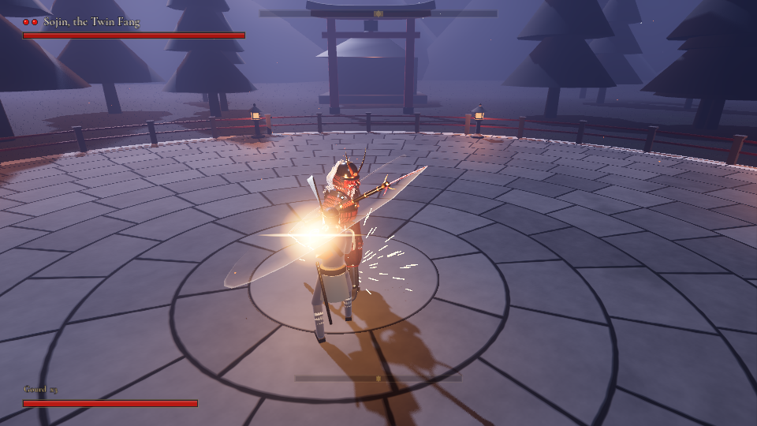

# Dankiro

A Sekiro-inspired boss fight prototype for **Godot 4.7** (Forward+, tested on 4.7.2).
One arena, one duel: you (a shinobi with a katana) against **Sojin, the Twin Fang**, an
armoured warrior with a 3.2 m staff that has a curved blade on each end.

The combat is tuned against a written spec of how Sekiro actually works:
[docs/SEKIRO_MECHANICS.md](docs/SEKIRO_MECHANICS.md). An automated combat lab checks the game
against it (see [Testing](#testing)).



*In-engine (Godot 4.7.2, rendered with Movie Maker): a perfect deflect of his Rising Fang.
The boss up close: [docs/boss_model.png](docs/boss_model.png), and
[before and after](docs/boss_before_after.png) his PS2-style model; the shinobi
[before and after](docs/player_before_after.png) his.*

## Running it

1. Install Godot **4.7** (standard build, no C# needed; 4.7.2 is what it's tested on).
2. Open `project.godot` in the editor. The first open imports the audio, textures and fonts.
3. Press **F5**. The game opens on the title menu: **Start fight**, **Options**, **Controls**
   and **Quit**. Use the mouse, or the arrows and Enter, or a gamepad (D-pad or left stick,
   A to select, B to go back).

Everything is generated from code: the effects and HUD are built at runtime, and both
fighters, the arena's flagstone floor and the world round it (forest, torii, shrine, lanterns,
mountains) are models that scripts build with Blender (see [Content pipeline](#content-pipeline-python)). `scenes/main.tscn` is just a root node with
`scripts/main.gd`.

## Controls

| Action | Keyboard / mouse | Gamepad |
| --- | --- | --- |
| Move | WASD | Left stick |
| Camera | Mouse | Right stick |
| Attack | Left mouse / J | RB |
| Guard / Deflect | Right mouse / K | LB |
| Dodge (hold to sprint) | Shift | B |
| Jump | Space | A |
| Lock on | Q / middle mouse | R3 |
| Heal (gourd, 3 uses) | R | X |
| Pause menu | Esc | Start |
| Controls panel | F1 | Back |
| Diagnostics overlay | F3 | |
| Fullscreen | F11 | |

The input map is registered in code (`scripts/autoload/game_input.gd`); actions you add in
*Project Settings > Input Map* are kept.

## Menus and options

- **Title menu** (on launch): Start fight, Options, Controls, Quit. He waits in the arena
  behind it.
- **Navigating:** mouse, keyboard (arrows, Enter, Esc) or gamepad (D-pad or left stick, A to
  select, B to go back). Left / right change an option's value; the list wraps round. Going
  back from Options or Controls returns to the item you came from.
- **Pause menu** (Esc / Start): Resume, Restart fight, Options, Controls, Quit to title.
  After a death or a victory, Enter / (A) goes straight back into the fight and Esc / (Start)
  goes to the title.
- **Options** (saved to `user://settings.cfg`):
  - **Starting phase** (1, 2 or 3): start the fight in a later phase, for testing. The
    earlier lives count as taken. It applies when a fight starts.
  - **Diagnostics** (also F3 in a fight): draws both fighters' hurtboxes at the radius the
    hit tests use (green hittable, cyan i-frames, yellow open to a punish, grey ignoring
    hits), the weapons (lit red while a hit window is open, orange for a perilous attack,
    yellow for your katana), your guard as a ring at your feet (gold while the deflect window
    is open, shrinking as it runs out, then blue for a block), shuriken in flight, and a
    marker where each blow lands (gold deflect, blue block, red hit, magenta mikiri, cyan
    dodged). A panel shows both fighters live: state, vitality, posture and its recovery
    rate, your deflect window and spam level, his phase, lives, sequence, break-out and
    parry counters, his current clip and hit window, and how you timed your last guard. It
    keeps drawing while the game is paused.

## Combat

### Deflecting (and blocking)

- Pressing guard opens a **0.200 s deflect window** (12 frames at 60 fps, as in Sekiro). If a
  blade touches you inside the window, you deflect. You get a bright golden spark burst with
  streaks, a star flash, a light pulse, a loud ringing "clang", a ~75 ms hit-stop, a small
  shove, controller rumble, and posture damage to the boss. A deflect can never break your own
  posture.
- **Spam penalty (as in Sekiro).** Pressing guard within **0.5 s of releasing it** shrinks the
  next window: 200 → 133 → 100 → 67 → 0 ms. It clears after 0.5 s without a quick re-press, and
  **immediately after a successful deflect**, so deflecting a flurry in rhythm works but
  mashing doesn't. Holding guard and letting go just before re-pressing counts too.
- **Blocking**: if a blade lands outside the window while your guard is up (held, or a tap
  less than 0.35 s old), you block. Blocking costs no vitality but a big chunk of *your*
  posture, with a quiet, dull clank and a small spark. Fill your posture while blocking and your
  guard breaks: you stagger, open to his next blow. Still holding guard when you recover, it
  comes straight back up (as a block), as in Sekiro. Pressing too early therefore blocks; only a
  very early tap lets a strike through.
- Deflecting several strikes in a row (each within 1.2 s) hits his posture harder: +12% per
  deflect, up to +36%.
- **Flurries** (the whirl, the jabs, a shuriken volley): missing one deflect doesn't cost you the
  string. A light blow knocks your guard down for only 0.12 s (0.22 s for a heavier one), and if
  you're holding guard it comes straight back up, so you block the rest; any press in that
  time is kept and comes up the moment you can guard. Mashing guard through a flurry keeps
  your guard up the whole time (your character just holds the guard pose), so everything
  gets blocked, and the spam penalty shrinks your deflect window, as in Sekiro.
- Timing is measured precisely. Physics runs at 120 Hz with agile input flushing. Presses are
  stamped with sub-tick game time, and blade contact time is found by a swept blade-versus-capsule
  test (`Combat.blade_vs_capsule`), so the window isn't rounded to frames. Press **F3** (the
  diagnostics overlay) to see how
  many milliseconds before contact you pressed, your current window, and your spam level.

### Your sword

- Slashes are committed, like Wolf's. The first cut lands ~0.28 s after the press, and chained
  slashes come every ~0.45–0.6 s: a diagonal cut, a rising return cut, then a heavy overhead.
  Mashing attack can't go faster than that.
- **Guard can cancel a slash only at the very start of the wind-up or in the recovery** after
  the blade has passed. Held during the committed swing, the guard comes up (with its deflect
  window) as soon as the recovery opens. A tap you've already let go of comes up then only if it
  was within the input buffer (0.22 s, as for attacks and dodges), so a stale tap can't open a
  late deflect window.
- When he blocks a slash, your sword bounces and the next one comes a beat later. Keep hitting
  his guard and he **parries** you, knocking your sword away, then counters, and often keeps
  pressing after the counter.
- Deflecting the end of his string, a kick or a punished recovery staggers him, and your first
  hits make him reel. After two (one or two in phase two) he **breaks out** instead of reeling
  again: he parries your next swing, hops back out of reach (your swings whiff while he's in
  the air) into a thrust or a leap, or takes the blow and answers with a fast cut or a sweep.
  Once he's back on his feet he often backs off, throws shuriken or attacks at once, and he
  avoids opening with the attack you just punished. You can't stun-lock him.

### Dodging

- The dodge is a short, quick step: 1.5 m back or to the side, and 1.1 m for the neutral
  step, which goes forward. It has Sekiro's i-frames: 0.2 s for side and back steps and 0.3 s
  forward. A strike that's still on you when the i-frames end hits you, so a step repositions
  you but doesn't get you out of a committed attack. Hold dodge to sprint.
- A forward step's i-frames don't cover thrusts, and no step's i-frames cover sweeps.

### Perilous attacks (危)

The kanji flashes red above him with a deep warning sound and his blades glow hot.

- **Perilous thrust:** he turns side-on, draws the staff back through his front hand, holds at
  full coil, then releases into a long lunge. Perform a **Mikiri Counter** by pressing
  **dodge with no direction held** *as he releases*: a neutral dodge is a short step forward
  into the thrust, as in Sekiro. Stepping during the pull-back is too early (you get hit), and
  holding forward gives a plain step that the thrust runs straight through. The counter stomps
  the blade for heavy posture damage. You can also deflect the thrust; blocking it fails.
  Backing off doesn't work: he closes in during the wind-up, tracks you through the release
  and stretches the lunge, so stepping, walking or sprinting away gets you stabbed.
- **Perilous sweep:** he slides his grip to the end of the staff, sinks low and spins a full
  turn with the far blade flat at shin height, ~2.5 m out, travelling forward. It can't be
  blocked or deflected, dodge i-frames don't save you, and he chases you down during the
  coil, so stepping, walking or sprinting away doesn't get you out of range. **Jump** over it. While airborne near him, press **jump again** to
  kick off him. That deals posture damage (×1.6 during a sweep) and staggers him out of the
  sweep. You can follow up with an air attack.

### The Inferno (phase two)

His fire move. He opens phase two with it, then uses it again every so often (at most once
every 40 s; phase three has it too).

- **The tell:** he leaps to the middle of the arena, which nothing else he does, and drives
  his staff into the stones. He channels with both hands on it while fire climbs the shaft,
  and the floor glows red out to the blast radius, brightest at its edge. **Get out of the
  glow.** He wrenches the staff free and the fire blast bursts out. It can't be guarded, stepped
  through or jumped: inside the glow it knocks you down and throws you out of it. From right
  beside him you have time to walk out, locked on, if you go as he leaps.
- **The sweeps (危):** he lifts the staff overhead with both ends ablaze, drops into a low stance
  with it level across his hips and starts to turn. Fire runs from both blades out past the
  walls, so there's nowhere out of reach. Each arm of fire is a sweep: guarding and dodging
  don't help, so **jump it**. Three arms come round on an even beat (1.5 s apart), then the
  fire flares and the **fourth comes round faster** (1.0 s), to catch you if you jump on the
  beat instead of watching the fire. The beat is the same wherever you stand, even if you
  walk round him. If an arm burns you, the next one waits until you're up (about 2 s).
- **Phase three: waves of fire.** In his last life the ring round him also throws off waves
  of flame that roll out across the plaza to the wall, so the fire comes at you head on as well
  as from the side. Each wave reaches you on the half-beat between two arms: arm, wave, arm,
  wave, arm, then the fast fourth arm, a jump every 0.9 s. To leave room for that the turn is a
  little slower than in phase two (1.8 s between arms; a jump and its landing take about
  0.77 s). A wave is steered like the turn, so the half-beat holds wherever you stand and while
  you move, and any jump from about 0.6 s to 0.1 s before it reaches you clears it. A
  bright line on the stones shows where it is. If the fire knocks you down, the waves still
  coming at you die out and nothing new comes until you're up.
- A **ring of fire** round him keeps you off him (it burns and shoves you back), and while he
  burns your sword glances off him. His **posture holds** while it lasts, so surviving it costs
  you none of the posture you'd built; it starts recovering again once he's spent.
- **The finisher (危):** the arms die away, he stands tall with the staff upright over his head,
  holds it, and drives it down into the stones. Cracks of fire race out across the floor and
  the **whole arena erupts**, rolling out from his staff. One jump, timed to the eruption,
  clears it: anywhere in the air you're safe, rising or falling. Jump too early and you land
  while it's still burning, too late and you're still on the ground when the flames reach you
  (a window of about 0.4 s, ending just as they leap up where you stand).
- **The payoff:** the fire gutters out and he's spent, leaning on his planted staff and
  panting. Hit him. His staff keeps smouldering for the rest of the fight.

### The Tempest of Fangs (phase three)

His signature string in his last life, a set you learn and then deflect, like Genichiro's
Floating Passage: six blows in a fixed rhythm, **ta-ta · · · ta-ta · · · · ta · · · TAAA**. The
pauses are the point: each one is a visible wind-up for what comes next, and pressing guard on
the beat of the quick blows gets you hit by the one after the pause.

- **The tell:** he stamps, sinks into a deep coil with the staff low behind him, and both blades
  flare with fire. He holds it for a beat (0.8 s before the first blow lands).
- **Two quick cuts:** a rising cut from your left, then a backhand from your right (0.4 s apart).
- **A pause** (0.9 s): he carries the staff round to his right, steps in and sinks into a coil,
  winding it a little tighter while he waits.
- **Two quick cuts again:** a flat cut from your left, a backhand from your right (0.35 s apart).
- **The long delay** (1.1 s): he stamps and lifts the staff to head height, drawn back with the
  blade over you (the jabs' tell), holds it and draws back further, then stabs down into your
  chest.
- **A last pause** (0.9 s): he rises tall with the staff overhead, the blades flare again, and he
  lunges in with an overhead cleave.
- He tracks you through the whole set and closes in between the blows, so backing off doesn't
  get you out of it, but he keeps his striking distance (about 2 m) instead of crowding you if
  you stand your ground. Blocking every blow breaks your guard on the cleave; deflecting the
  set loads his posture (+88) and leaves him open for a moment after the cleave.

### Posture and the deathblow

- Deflects, mikiri counters, kicks and hits all build his posture. So do attacks he blocks,
  and each shuriken you deflect chips it a little (4 of his 300; a deflected blade does 7 to 16).
  If a shuriken fills it while he's in the air, he breaks as he lands.
- His posture recovers when you ease off, and it recovers more slowly as his vitality drops.
  Hitting him makes the posture war easier. It holds through the Inferno, when you can't touch him.
- When his posture breaks (or his vitality empties), he drops to one knee under a red mark.
  Press **Attack** close to him to perform a **deathblow**: the camera swings round beside the
  two of you for the kill, time slows as the blade goes in, blood sprays across the stones and
  忍殺 (shinobi execution) stamps onto the screen.
- He has **three lives**, one per phase. After each deathblow he rises into the next phase.
  Phase two is faster, more aggressive and parries more, and he opens it with the Inferno.
  Phase three adds his Tempest of Fangs (see above) and a harder Inferno (waves of fire between
  the arms; it isn't his opener there).

### His behaviour

- His whole staff is dangerous: hit windows test both blades *and* the shaft, so standing
  close is no escape. During wind-ups he shuffles in to his striking distance and tracks you
  hard, so a strike started at the edge of his range still arrives.
- He moves with intent: he stalks at a varying pace, sometimes stops to watch you, runs to a new
  spot and opens with a special from there, and **runs at you** to flow into a running cut.
  Backing off or running away makes him charge or leap after you. If you keep your distance he
  may plant his staff with a stamp and a slow breath, daring you in, which leaves him open.
- He guards most attacks from neutral and often strikes right after you stop hitting his guard.
- He punishes healing at range with thrusts and leaping cleaves.
- His attack strings end in mix-ups: combo → combo → *(delayed overhead | perilous thrust | perilous sweep)*.

| Attack | Tell | Answer |
| --- | --- | --- |
| Rising Fang → Turning Fang → Heaven's Fall | Coils right, low blade trails behind | Deflect each hit. The overhead finisher is **delayed**, so wait for it. |
| Fang Jabs | Stamps and lifts the staff to head height, drawn back with the blade over you, and holds it for a beat (no kanji) | Deflect twice: each stab drops the blade into your chest. Mikiri doesn't work on these. |
| Perilous Thrust 危 | Turns side-on, draws the staff back and holds at full coil | Mikiri (neutral dodge on the release) or deflect |
| Perilous Sweep 危 | Slides his grip to the staff's end, sinks low and coils to his left | Jump, then kick |
| Whirling Fangs | Raises the staff level overhead with a whoosh, then cocks it at his side and the windmill spins up | Deflect each blade as it comes down on you (4 chops, one every 0.375 s, each with a whoosh that peaks on contact), then the finishing cut after a pause |
| Inferno 危 (phase two) | Leaps to the middle of the arena and drives his staff into the stones; the floor glows out to the blast radius | Get out of the glow before the blast. Then jump each arm of fire: three on an even beat, a faster fourth (in phase three, jump the wave of fire rolling out from him between each of the first three too). Then he raises the staff over his head and plunges it into the floor: jump as the arena erupts. Hit him while he's spent |
| Tempest of Fangs (phase three) | Stamps and sinks into a deep coil with the staff low behind him; both blades flare with fire and he holds it for a beat | Deflect the set: **ta-ta · · · ta-ta · · · · ta · · · TAAA**. Two quick cuts (from your left, then your right); a pause while he steps in and coils; two quick again (left, right); the long delay, the staff held at head height with the blade over you, then a stab; a pause with the staff overhead and the blades flaring, then a lunging overhead cleave. Wait out each pause: pressing on the quick beat gets you hit. He tracks you and closes in, so backing off fails; blocking the whole set breaks your guard |
| Shuriken volley | Quick crouch, hand to his belt with a glint of steel, leaps back and hangs for a beat at the top, throwing hand glinting | Deflect each glowing star as it reaches you: **3 in the air + 1 delayed**, or **5 in the air**. From phase 2 on, **a second set** straight after, thrown from the ground (another glint first) |
| Running Cut | Runs at you, staff swinging up behind his shoulder | Deflect (it tracks hard) |
| Falling Crescent | Crouches at range, leaps with the staff overhead | Deflect on landing (high) |
| Parry Counter | Deflects your attack | Guard right away |

## Testing

Everything below runs headless from the project folder with the `godot` binary on your PATH.

**Combat lab**: `tests/combat_lab.tscn` spawns the fighters, drives the player with scripted,
time-stamped inputs (through the same `press_guard` / `press_action` calls the controller
uses), forces boss attacks and checks the results against
[docs/SEKIRO_MECHANICS.md](docs/SEKIRO_MECHANICS.md).

```
godot --headless --fixed-fps 120 res://tests/combat_lab.tscn -- [suite ...] [--verbose]
```

| Suite | What it checks |
| --- | --- |
| `reach` | Every hit window of every boss attack (including the running cut) connects from point-blank to the edge of its range, straight on and 25° off-axis |
| `tells` | When each attack's blows land from 1.4 to 2.6 m: every blow lands as the blade reaches you (not the instant its hit window opens, which would mean the blade was already touching you), and every opener gives at least 0.45 s of warning |
| `deflect` | Presses 0–200 ms before contact deflect; earlier ones block (held, or a tap still up); late ones get hit; perilous thrusts can't be blocked; a deflect never guard-breaks you; a deflect that breaks his posture partway through a multi-hit attack staggers him cleanly |
| `flurry` | After a blow of the whirl, the jabs or a shuriken volley lands, holding guard blocks the rest; mashing guard through them never lets a blow through; a guard held through a guard break is back up after the stagger and blocks the next blow |
| `punish` | Deflect an attack, then mash attack: he reels from at most a few hits, then stops it (guards, parries or hits back) |
| `phases` | Three lives, one per phase: the starting-phase option starts a fight in phase 2 or 3 with the earlier lives taken, each deathblow raises him into the next phase, the last one ends the fight |
| `camera` | In the real arena: with your back to the fence anywhere round the rim, the lock-on camera keeps its full distance (the wall that keeps the fighters in doesn't squeeze it onto your back), and that wall still stops both fighters |
| `ribbons` | Cloth and hair (your scarf and headband tails, his mane, sashes and tassels): on a bench, a scarf on a walking body sways gently and a towed or turned chain never folds; in the arena every tip sways under 2.5 Hz while you both stand and while you walk round him, and through his combo his hair and sashes move no quicker than his body |
| `menu` | The menus with a gamepad only (simulated pad input through Godot's input pipeline): D-pad and stick move one row per push, A selects, left / right change options, B goes back, Start pauses and A on Resume carries on; a closed menu lets go of its highlight; the hints show the keyboard's keys until the pad is used, then its buttons |
| `loop` | Two 90 s fights against bots that deflect everything, one hitting him only when he's open and one hitting whenever he's in reach: no more than 3 hits leave him reeling between his attacks, and he rarely reopens with the attack he was just punished for |
| `spam` | The window shrinks 200/133/100/67/0 ms when mashing, clears after 0.5 s and on a deflect |
| `mikiri` | Only a neutral step from the release on counters the thrust; during the pull-back is too early; forward-held and side steps never counter. Backstepping (once or twice), an early side step, or a backstep into a sprint all still get stabbed, from 2.4 to 4.4 m |
| `dodge` | Steps are short (1.5 m, 1.1 m for the neutral step) and have Sekiro's i-frames (0.2 s, 0.3 s forward, forward not against thrusts) |
| `sweep` | Guarding and dodge i-frames fail against the sweep, and so does getting away (stepping back or aside, two backsteps, sprinting or walking away, from 1.5 to 3.4 m); jumping clears it, and the kick deals posture |
| `shuriken` | Volley rhythms (3 in the air + 1 delayed, 5 in the air), a readable tell before the first; from phase 2 on two sets, the second 0.4 to 0.55 s after the first; every throw deflectable (4 posture to him each; one that fills his posture in mid-air breaks him as he lands) or blockable, a whole double volley included |
| `tempest` | Phase three's Tempest of Fangs: deflecting each blow as it comes clears all six from 2.2 and 3.4 m and loads his posture, and the rhythm holds (two quick, a pause, two quick, a long delay, one, a pause, the last); pressing guard on the quick blows' beat deflects those but gets hit by each blow after a pause; holding guard blocks every blow and the last breaks your guard; backing away locked on doesn't get you out of it; he only picks it in phase three (it's also in `reach`, `tells` and `flurry`) |
| `attack` | Slash reach, and that mashing is rate-limited (no two hits within 0.38 s) |
| `cancel` | Guard cancels a slash only in the early wind-up and in the recovery; a guard tap let go of long before the recovery doesn't come up in it, while one just before it does, and so does a tap during hit-stun (as the stun ends); a lost dodge release cannot leave sprint held |
| `inferno` | Phase 2 opens with the Inferno (starting there, or rising into it); he lands in the middle of the arena; the blast misses you outside its radius, knocks you down and throws you out of it inside, and walking away locked on from right beside him gets clear in time (stepping through it doesn't); jumping each arm clears all four from 4 to 14 m out, the beat holds (1.5, 1.5, 1.0 s) wherever you stand and while you walk round him; standing, guarding and dodging get burned by every arm and by the eruption; jumping on the beat gets caught by the fourth; one jump timed to the eruption clears it (in the air you're clear), earlier or later burns (it prints the window), and it rolls outward, reaching the wall a moment after it bursts beside him; after a burn the next arm, or the eruption, waits until you can jump it. Phase 3: jumping each arm, each wave and the eruption clears them all from 4 to 14 m out, each wave comes on the half-beat between two arms and there's never less than 0.9 s between two things to jump, still so walking round him or backing away; watching only the arms, a wave burns you; after any burn nothing reaches you for 2 s; it prints how early or late a jump over a wave may be; phase 2 has no waves. The ring stops you and burns; your sword glances off him; his posture holds through it; he's open afterwards; he uses it again once it's off cooldown |
| `soak` | A full fight against the real AI (charges, repositioning, volleys) with a bot player that reacts to the blade and to incoming shuriken: deflects, blocks, posture breaks, deathblows (each signalling 忍殺 once, the last as the final one), the next phase and the Inferno it opens with |

The run exits with code 0 when every check passes (806 checks, including the soak). It also
fails if the engine or a script reports any error during the run (it listens through a
`Logger`), so runtime errors can't hide behind passing gameplay checks.

**Captures**: `tests/capture.tscn` stages shots (`overview`, `deflect`, `deflect_offcenter`,
`block`, `mikiri`, `thrust_backstep`, `sweep`, `sweep_flee`, `whirl`, `shuriken`, `shuriken5` (`double` for
phase 2's two sets),
`charge`, `slashes`, `parried`, `tempest` for phase three's six-blow string (`tempest side` from beside
the fighters, `tempest hold` holding guard through it), `edge` (the lock-on camera with your back to the fence at eight
places round the rim), `ribbons` for cloth and hair in motion (`ribbons close` behind you, `ribbons boss`
behind him through his combo), `deathblow` (a posture break and the kill; `deathblow final`
for his last life, then the victory screen), `inferno` for his fire move (`inferno stand` to take the
arms, `inferno wide` from high above the arena, `inferno spin` straight to the arms of fire, `inferno plunge`
straight to the finisher; add `p3` for phase three's, with the waves), `attack <clip> [distance]` for any single boss attack from
the lock-on camera, `recovery <clip>` for one attack played to the end from a fixed 3/4 view,
`fire_staff [level]` and `fire_combo` for the fire on his staff, `diagnostics` for the overlay, the menus `menu_title`, `menu_options`, `menu_controls`, `menu_pause` and `menu_start` (boot,
then press Start), `help` for the controls sheet (F1) over the fight, the HUD `ui_hud`, `ui_hud_fresh` and
`ui_hud_low` (both fighters hurt, the fight's start, nearly finished), `ui_moment <what>` for one of its
moments (`namecard`, `callout`, `deathblow`, `execution`, `death`, `victory`, `help`), the model close-ups `model`, `model_head`, `model_face`,
`model_face_p2`, `model_combo`, `model_flourish`, `player_model`, `player_head`, `player_face`,
`player_moves` (the shinobi: an orbit, his head and face, and his slashes, a backstep, a jump and
the gourd), `floor <view>` for the plaza from fixed
cameras: `overview`, `centre`, `medallion`, `puddle`, `moss`, `broken`, `rim`, `low`, `sweep`, and
`scenery <view>` for the world round it: `torii`, `gate`, `north`, `south`, `east`, `west`,
`vista`, `cliff`, `grove`, `shrine`, `lantern`, `high`)
in the real scene, with a bot reacting to his
hit windows. It records them with Godot's Movie Maker:

```
godot --write-movie out/frame.png --fixed-fps 30 res://tests/capture.tscn -- deflect
```

To record at a smaller size, put an `override.cfg` with
`window/size/window_width_override` / `window_height_override` under `[display]` in the
project folder (it's git-ignored). Without a GPU, this works under `xvfb-run` with Mesa's
lavapipe Vulkan driver.

For UI work there's a flat mode: with `DANKIRO_FLAT=<png>` set, the 3D world isn't drawn and
that still picture stands behind the live HUD or menu instead. Render the picture once with the
shot `plate_fight` (the fight, HUD hidden) or `menu_plate` (the title screen without its menu);
after that a 1920x1080 frame of any UI shot takes a moment instead of 20 s.

## Project layout

```
project.godot              Godot 4.7, Forward+, 120 Hz physics, agile input flushing
scenes/main.tscn           root node -> scripts/main.gd (builds and runs the fight)
tests/                     combat lab (automated checks) and the Movie Maker capture director
docs/SEKIRO_MECHANICS.md   the combat spec: what Sekiro does and how this project implements it
scripts/
  autoload/                GameInput (input map), Game (clock, hit-stop, shake), Sfx (audio)
  anim/                    PoseAnimator, ClipData, HumanoidRig (FK + two-bone IK), PoseMath
  rig/                     MeshKit (procedural meshes), ModelBuilder, SkinnedModel, SpringChain (cloth/hair)
  characters/              Combatant (base), Player, Boss (+ AI)
  combat/combat.gd         all tuning constants + hit geometry
  fx/                      sparks / flashes / blood / dust / kanji, weapon trails
  camera/, ui/, world/     lock-on camera, HUD + overlays, arena and the scenery round it
shaders/                   night sky, flagstones, mortar bed, puddle, fire, and the scenery's: foliage and
                           leaf cards, bark, stone, lacquer and timber, roof, lattice doors, terrain,
                           mountains, cloud sea
data/                      rigs.json, animations.json, models.json (generated, see below)
models/                    player.glb, player_katana.glb, boss.glb, boss_staff.glb + ribbon textures,
                           arena_floor.glb, scenery/*.glb (generated with Blender)
audio/, textures/, fonts/  sound effects (+ CREDITS.md), brush kanji, floor and scenery textures, UI fonts (OFL)
tools/                     Python content pipeline + previewers (ignored by Godot)
  model3d/                 scripted Blender modelling: mesh builders, pattern, floor and scenery textures, baking
```

## Content pipeline (Python)

Animations, models, sounds and kanji are generated by scripts, so they're easy to tweak.
You need Python 3.10+ with `numpy scipy matplotlib pillow fonttools`. Rebuilding the fighters'
models, the floor or the scenery also needs Blender as a Python module: `pip install bpy==4.5.9`
(Blender 4.5 LTS, Python 3.11), and the floor needs `shapely`.

| What | Edit | Rebuild | Check |
| --- | --- | --- | --- |
| Animations + hit windows | `tools/build_animations.py` | `python3 tools/build_animations.py` | `python3 tools/anim_preview.py b_thrust` renders contact sheets, and `--all --check` reports IK reach, blade reach, rotations that take the long way between keys and recoveries where his blade whips back faster than 18 m/s. The build keeps the long staff above the floor (at any dip it inserts a key that tilts the staff about the hands) and unwinds his rotations so each takes the shortest way to the next key |
| Player model (skinned, textured) and katana | `tools/build_player_model.py`, `tools/model3d/` (`player_spec.py`, `charkit.py`) | `python3 tools/build_player_model.py` (~3.5 min with the bake; `--shapes` for a 40 s look without it), then `godot --headless --editor --quit` to import | `--preview` renders `tools/preview_out/player_*.png`; in the engine, the capture shots `player_model`, `player_head`, `player_face`, `player_moves` |
| Boss model (skinned, textured) | `tools/build_boss_model.py`, `tools/model3d/` | `python3 tools/build_boss_model.py` (~3 min with the bake), then `godot --headless --editor --quit` to import | `--preview` renders `tools/preview_out/boss_*.png`; in the engine, the capture shots `model`, `model_head`, `model_face`, `model_combo` |
| Arena floor (flagstones, textures) | `tools/build_arena_floor.py`, `tools/model3d/floor_textures.py`, `shaders/flagstones.gdshader` | `python3 tools/build_arena_floor.py` (~3 min with the AO bake; `--no-bake` for quick layout changes, `--textures` for the tiling textures only), then `godot --headless --editor --quit` to import | `tools/preview_out/floor_ao.png` shows the plan and the baked occlusion; in the engine, the capture shots `floor overview`, `floor centre`, `floor puddle`, ... |
| The world round the plaza (trees, torii, shrine, lanterns, fence, terrain, mountains) | `tools/build_scenery.py`, `tools/model3d/scenery_textures.py`, `scripts/world/scenery.gd` (placement, and the material table that maps each model material to a shader) | `python3 tools/build_scenery.py` (about a minute; `--only trees torii props approach backdrop textures` for some, `--no-bake` to skip the occlusion bakes), then `godot --headless --editor --quit` to import | `--preview` renders `tools/preview_out/scenery_*.png`; in the engine, the capture shots `scenery torii`, `scenery vista`, `scenery grove`, ... |
| The fighters' materials, ribbons (scarves, sashes, hair, headband tails) and the gourd | `tools/build_models.py` | `python3 tools/build_models.py` | |
| Sound effects | `tools/gen_audio.py` (the recipes), `tools/audio_sources.py` (the recordings: where each comes from, its author and licence) | `python3 tools/gen_audio.py [name]` (needs `ffmpeg`; the first run fetches the recordings from pinned commits into `tools/.cache/audio_src/`; a full build rewrites `audio/CREDITS.md`), then `godot --headless --editor --quit` to import new files | every sound is set to a loudness (K-weighted, the loudest 100 ms) and peak-limited, so the volumes the game plays them at mean the same for all |
| Effect textures: the noise the fire, weapon trails and dust scroll through, and the blood splatter | `tools/gen_fx_textures.py` | `python3 tools/gen_fx_textures.py` | the capture shots `fire_staff 0.3`, `fire_staff 1`, `fire_combo`, `inferno spin`, `deathblow` |
| Kanji + UI fonts | `tools/gen_textures.py` | `python3 tools/gen_textures.py` | |
| GDScript sanity | | | `python3 tools/check_gdscript.py` cross-checks member and function names and call arity across the scripts |

How the animation system works:

- Each pose is a set of channels: hips position/rotation, spine and chest, foot targets, and the
  **weapon transform**. Legs use two-bone IK and hands grip the animated weapon with IK, which
  keeps two-handed staff swings coherent.
- Keys are interpolated with monotone cubic curves; rotations are interpolated as Euler angles,
  so the build re-expresses each of his keys' angles as the equivalent nearest the previous
  key's (otherwise the turns of a spin would unwind as a spin in his hands on the way back to
  his stance). Clips carry the gameplay metadata: hit
  windows (`hits`), boss tracking rates (`track`), gap-closing (`close`), recovery openings
  (`vuln`), combo timing (`combo_at`), guard-cancel windows (`guard_cancel`), i-frames and the
  mikiri window.
- `tools/rigmath.py` mirrors the GDScript solver exactly, so the previews match the game.

How the boss model is built (PS2-style: ~25k triangles, one 2048 px atlas with baked lighting):

- Every armour piece is parametric, in game space: lamellar lames are narrow revolved bands,
  the cuirass is lofted from boxy rings, the helmet bowl has raised ridges, and the oni mask
  is a displaced grid with the eye and mouth openings cut out. Plates get thickness and
  bevelled edges from Blender modifiers.
- Skinning is by rule: plates are rigid on one joint, cloth blends between joints, and
  *helper bones* carry the shoulder guards and skirt panels partway between two joints
  (`tools/model3d/boss_spec.py`), so they swing with the arms and legs without stretching.
  In the game, `SkinnedModel` copies each solved joint of the `HumanoidRig` onto the
  skeleton after every pose.
- Textures are painted by code (`tools/model3d/textures.py`: red-laced lamellar with
  cross-knots, lacquer, gold, brocade, mail, hakama cloth, the mask's face paint) and Cycles
  bakes them with ambient occlusion, worn edges and a soft top light into the atlas, with the
  arms and legs spread so occlusion isn't baked into the flanks. The face gets its own
  1024 px texture.
- The staff has tiled lacquer, gold and silk-wrap materials, and its blades carry a hamon
  texture plus an emission mask, so his glow runs along the cutting edge.
- The `.glb` imports keep their textures embedded (`gltf/embedded_image_handling=3` in the
  `.import` files), so Godot doesn't extract duplicate PNGs into `models/`.

## Tuning

- `scripts/combat/combat.gd` holds the deflect windows, spam penalty, hit-stop lengths, HP,
  posture and regen values, and mikiri and kick posture damage.
- `scripts/characters/boss.gd` holds `SEQUENCES`, his attack strings: the options at each step,
  the chance to continue, distance ranges and weights.
- Per-attack damage and posture numbers are in the `hits` entries in `tools/build_animations.py`
  (the shuriken's in `Boss._throw_shuriken`).

## Status

This milestone was built and tested in **Godot 4.7.2**. The combat lab passes (806 checks, including
a full-fight soak), the game boots and runs with no script errors, and every change to the
visuals was checked on frames rendered with Movie Maker.

**Latest: the Tempest of Fangs, phase three's own attack.** In his last life he has a signature
string, in the spirit of Genichiro's Floating Passage: he stamps, sinks into a deep coil and
both blades flare with fire, then comes at you with six blows in a rhythm you can learn,
**ta-ta · · · ta-ta · · · · ta · · · TAAA**: two quick cuts from alternating sides, a pause while
he steps in and coils, two quick again, the long delay (the staff held at head height with the
blade over you) and a stab, then he rises with the staff overhead, the blades flare again, and
he lunges in with an overhead cleave. The pauses are visible wind-ups, and pressing on the quick
beat gets you hit by the blow after each one. Each blow is a swing you've seen on its own, with
its own wind-up and a whoosh that peaks as it reaches you.
He tracks you and closes in between the blows, so you can't back out of it: deflect the set
(it loads +88 on his posture); block it all and the cleave breaks your guard. He keeps his
striking distance (about 2 m) instead of walking into you (a clip's new `hold_distance`). The
new lab suite `tempest` checks it all, and the capture shot `tempest` (`side`, `hold`) films it.

**Before that: phase three's Inferno sends waves of fire.** In his last life the ring of fire round him
throws off waves that roll out to the wall between the sweeping arms, so the fire comes at you head
on too: arm, wave, arm, wave, arm, then the fast fourth, a jump every 0.9 s (the turn is a
little slower to leave room for it). Each wave is steered to reach you on its half-beat
wherever you stand, a bright line on the stones shows where it is, and after a burn the waves
still coming die out until you're up. The lab plays it from 4 to 14 m out, walking round him and
backing away, and clears it every time; watching only the arms gets you burned. The capture
shots `inferno wide p3` and `inferno spin p3` film it ([from above](docs/inferno_waves.png)).

**Before that: new sound.** Every sound effect is rebuilt from real recordings instead of pure
synthesis: CC0 and CC BY material (the Versilian Community Sample Library's anvil, brake drum,
gongs, cymbals, bells and drums; freesound recordings from Sonic Pi's sample set; Kenney's
footsteps, cloth, steel draws and knife slices; wind, fire, fuses and flares from Blanket, Minetest Game and Veloren), cut, pitched,
filtered and layered with synthesized parts by `tools/gen_audio.py` (credits in
`audio/CREDITS.md`).

- **Deflect**: it has a voice of its own, in two layers. The strike (six variations: an anvil
  crack, a real knife's hiss of steel on steel, a glint of bright air, a thump) plays where the
  blades meet. Over it, a wide stereo ring carries the deflect's note, a bright, pure B6 over a
  finger cymbal tuned to it, the same every time so you learn it as the sound of getting it
  right, with its shimmer and a soft wash of air spread across the speakers. The deflect,
  block and parry sounds import uncompressed, so nothing grits them up. It plays on its own bus, and
  everything else (swings, fire, wind) ducks under it for a moment. A flurry's rings climb the
  major pentatonic (root, 2nd, 3rd, 5th), so a clean exchange rings out as a rising phrase and
  overlapping rings stay in tune.
- **Block**: five damped brake-drum clunks, lower and duller, with no ring to speak of, 8 dB under
  the deflect: you can tell them apart without looking. His parry of your blade is its own
  heavier, lower clang.
- **Perilous**: a taiko-like drum, a gong, an anvil sting and two tubular bells a tritone apart.
- Hits, the katana's and the staff's swings, the mikiri stomp, posture and guard breaks, the
  deathblow, footsteps, the gourd, the Inferno's fire and a real wind recording for the night
  air are all new too.
- A bank now deals its variations like a shuffled deck (never the same one twice in a row) from
  Sfx's own random numbers, so sounds no longer draw on the game's RNG. The wind loops seamlessly.

**Before that: two sets of shuriken in phases 2 and 3.** From phase 2 on, his shuriken volleys come
twice: he leaps back and throws the first set as before (3 in the air + 1 delayed, or 5 in the
air), then comes up from the landing into a low stance, his throwing hand glints, and he throws
the same set again from the ground, 0.4 to 0.55 s after the first. Blocking a shuriken now costs
you 9 posture (it was 12), so a whole double volley blocked from a fresh guard costs 90 of your
100: you get through it, just, but deflecting them is the real answer. The capture shots
`shuriken double` and `shuriken5 double` film it.

**Before that: calmer cloth and hair, bolder bars.**

- **Ribbons and his mane** ([before and after](docs/ribbons_before_after.png)): your scarf and
  headband tails, his horsehair mane, his sashes and the staff's tassels buzzed at 5 to 9 Hz and
  whipped about (a walking scarf's tip averaged 9 m/s). The
  chain solver (`SpringChain`) is rebuilt in physical units: the air drags hard across a ribbon's
  face and lightly edge-on, as it does real cloth; a gentle spring pulls each point toward its place
  on the rest shape, measured from the root (the old pull toward each point's parent pushed without
  pushing back, and fed a towed ribbon energy until it snaked); a breeze sends a slow flutter down
  the cloth as a wave; and slow motion and hit-stop slow and freeze it. Cloth and hair now sway at
  1 to 2 Hz and trail and ripple as you move (that scarf's tip: 1.9 m/s at about 1.3 Hz), and
  through his combo his mane moves more slowly than his head does. The lab's new `ribbons` suite
  checks it, and the capture shot `ribbons` (`close`, `boss`) films it.
- **HUD bars** are thicker (8 px for vitality, 7 for posture) on a darker track with a fine edge, so
  they read at a glance over bright stone.

**Before that: a new UI.** The HUD, the menus and the overlays are redesigned in one quiet style
([before and after](docs/ui_before_after.png)): ink and ivory, with vermilion kept for what
matters (damage, his deathblow marks, the deathblow, death), thin flat shapes, and no frames or
ornament.

- **HUD**: Sekiro's layout (his vitality and deathblow marks top left, his posture top centre,
  yours bottom centre, your vitality and the gourd bottom left) as thin ivory bars on dark
  tracks. Damage shows as a vermilion chip that drains a moment later. Posture fills from the
  centre, amber turning vermilion and glowing as it nears breaking, with ticks at the centre and
  where it breaks. Your bar turns vermilion and breathes when a blow or two from death.
- **Its moments**: his name as the fight begins, like a film's title card; MIKIRI COUNTER with a
  vermilion line drawn out under it; a red mark on him and a DEATHBLOW prompt with the button to
  press; 忍殺 and 死 over the scene blurred and drained of colour, with what you can do next.
- **Menus**: words on the left and no boxes. A vermilion line glides to the highlighted item,
  which eases to the right; options show their value at the right, with arrows while
  highlighted. The pause menu and the Controls page sit over the fight, blurred.
- **Prompts that follow your device**: keys, mouse buttons and pad buttons are drawn as glyphs
  (a mouse with the button to press lit, the face buttons in their colours), and the hints and
  the deathblow prompt switch between keyboard and gamepad with whichever you last pressed.
- **Type**: Jost, a geometric sans, for text and numbers; Cormorant Garamond for names and
  titles. Both are variable fonts, installed by `tools/gen_textures.py`.

**Before that: the shinobi.** You were the last thing left as primitives bolted to the joints. You're
now a skinned, textured model built by a Blender script like the boss
([before and after](docs/player_before_after.png)):

- A hooded shinobi with the lower face masked by a separate cloth that drapes from the nose, eyes
  and heavy brows showing through the slit, and an iron plate on the headband (its tails flutter
  behind).
- An indigo jacket quilted with sashiko crosses, pale crossed collars over a glimpse of mail, a
  crimson obi knotted at the back and a crimson scarf wound twice round the neck (its tails fly).
- Iron shoulder guards laced in crimson, splinted guards over pale wrapped forearms, gloved fists.
- Slim trousers tied into cross-bound shin wraps, split-toed tabi on straw sandals.
- The empty scabbard at the left hip with its cord, a pouch on the obi, and a new katana:
  tempered blade, copper habaki, iron tsuba, dark silk wrap over white rayskin.

**Also: three fixes from a review.**

- **Holding guard through a guard break**: when blocking filled your posture and broke your
  guard, the game dropped the held button, so after the stagger your guard stayed down and the
  next blow hit you until you let go and pressed again. Now a guard still held when you
  recover comes straight back up, as a block.
- **The camera at the edge of the arena**: backed against the fence, the lock-on camera
  collided with the invisible wall that keeps the fighters in (4 m tall, above the knee-high
  fence) and was squeezed to 0.3 m behind your head. That wall is now only for the fighters:
  the camera keeps its distance and looks over the fence, and bushes it comes close to out there
  dissolve rather than fill the view.
- **His posture during the Inferno**: your sword can't touch him for its ~12 s, yet his posture
  kept recovering, so surviving it cost you most of what you'd built (240 of 300 fell to about
  100). It now holds until he's spent.

**Before that: the fight's finishing touches.** A polish pass on what you see while fighting him
([before and after](docs/polish_before_after.png)):

- **Deathblows** are staged: the camera swings round beside the two of you, low and close, and
  pushes in while time slows as the blade goes in; blood sprays across the stones and 忍殺
  (shinobi execution) stamps onto the screen above you. The camera eases back as he rises.
- **Blood** is red streaking drops, a fine spray and a red haze (it was small black beads), and it
  splatters the flagstones where it comes down, fading after a while.
- **Weapon trails** are a crisp line of light along the blade's path with fine streaks behind it
  (they were pale translucent sheets): steel-white for your sword, white-gold to ember red for
  his burning blades.
- **Dust** billows, its edges eaten by noise and lit by the scene (it was round soft blobs).
- **Moon shadows**: the tree crowns cast a light, dappled shade on the plaza instead of dark
  smears that read as dirt, and all shadows are crisper.
- **HUD**: gilt-framed gauges with pointed end caps, fills lit from above, his lives as red beads,
  a gourd icon with its uses, and bigger text.
- **Controls** (F1, and the menus' Controls page): a laid-out sheet in the game's serif, with
  keycaps for keyboard, mouse and gamepad beside how to fight (it was monospace text).
- **Camera**: the lock-on camera sits lower and closer, so he looms over you and the shrine and
  the trees fill the top of the screen rather than the floor.

**Also: deflected shuriken chip his posture.** Each shuriken you deflect costs him 4 posture
(of 300; a deflected blade does 7 to 16), with no flinch and no deflect-chain bonus, so a volley
deflected in full is worth about two deflected blades. In Sekiro a deflected projectile costs
the thrower nothing. If one fills his posture while he's in the air, he breaks as he lands.

**Before that: the world round the plaza.** The trees, torii, shrine and mountains were primitives
(cones on sticks, boxes, seven-sided pyramids); now they are models built by a Blender script,
like the boss and the floor, with their own textures and shaders. A wood of Japanese cedars
rings the plaza, with an old sacred cedar roped with a shimenawa beside the steps, black pines,
red autumn maples by the fence and among the cedars, shrubs, ferns and mossy boulders. Each crown is clumps of
foliage under cards of leaf sprays that always face the camera, so the outline of every tree is
needles or leaves, and the crowns sway. North of the plaza a stone path leads through a
vermilion myojin torii (its gilt plaque reads 月門, Moon Gate) to a flight of steps and a shrine
hall on a walled court: lacquered posts, lattice doors glowing from within, a straw rope with
paper streamers, and a curved copper roof with crossed finials. Stone lanterns stand round the
plaza and along the approach, and a granite and lacquer fence rings the plaza. To the east the
wood stops at a cliff a few metres past the fence, and the view opens over mist in the valley to
three ranges of mountains, the farthest snow-capped, fading into the night sky
([close-ups](docs/scenery.png), [before and after](docs/scenery_before_after.png)).

**Before that: new fire.** Every flame is now drawn by a shader instead of a painted sprite: tongues
of fire that lick and flicker as noise scrolls up through them, white-yellow at the root, orange,
then red at the tips, with embers and a little smoke over the big fires. From phase two his staff
smoulders with small flames that cling to the blades, kept low so his strikes read clearly;
in the Inferno they blaze and stream behind the blades, and the arms of fire, the ring round
him and the blast use the same fire. The finisher's eruption lost its rings of flame (they read
as walls; it's the floor that burns) except the one round him.

**Before that: a new plaza floor.** The flagstones were a flat shader; now they're a model built by a
Blender script, like the boss. The plan is the same (a carved moon medallion at the centre,
eight wedges, twelve rings of flagstones and a raised basalt curb under the fence), but every
stone is a real slab with rounded, worn edges and a dark joint down to the mortar bed, set a
few millimetres off level. Most are granite, some slate or sandstone, a few newer and sharper,
some old and rounded. Some are chipped, some carry hairline cracks, some are cracked right
through, one by the lanterns is broken with its rubble lying in the hole, and a few settled
stones hold a puddle that catches the lantern light. Moss grows along the joints near the
fence, round the lantern bases and over one old stone; dirt gathers at the edges, old soot
darkens the medallion and the middle is worn smooth. Cycles bakes the occlusion of the joints,
curb, lanterns and fence posts into the textures ([before and after](docs/floor_before_after.png)).

**Also: the eruption no longer burns you in mid-air.** It burned anyone whose feet were below
0.6 m at any moment of its quarter second, so jumping as it erupted, or coming down a moment
early, burned you in the air. Now being in a jump clears it, and the burn rolls outward with
the flames, so it reaches you when they do: jump anywhere in the 0.4 s before they leap up
where you stand. The HUD's "jump in" readout counts down to that moment.

**Before that: the Inferno, phase two's fire move.** He opens phase two with it and uses it again
every so often. He leaps to the middle of the arena and channels fire into his planted staff
while the floor glows out to the blast radius; the blast throws you out if you're still
inside. Then he turns with the staff level and both ends ablaze, fire reaching past the walls:
jump each arm, three on an even beat and a faster fourth. A ring of fire keeps you off him,
and he's open once the fire dies. It ends with a finisher: he plunges the staff into the
floor and the whole arena erupts, one jump timed to it clears it. New animations, fire effects
and sounds, the move in the diagnostics overlay, and an `inferno` lab suite (see *The Inferno*
above). The shuriken also lost the light streak that trailed behind them.

**Before that: no more staff flourish after his attacks.** After some attacks the staff spun or
whipped in his hands as he returned to his stance: a full circle after the sweep, one and a
half turns after the whirl, a long swing after Rising Fang, a twist after the backhand,
Turning Fang, the running cut and the parry counter. Rotations are interpolated as Euler
angles, and the angles carried the turns of each spin, so going back to his stance unwound
them. The build now unwinds every rotation to the shortest way, the returns that were as fast
as a strike take a little longer (he stays punishable throughout), the staff turns end for end
calmly as he rises from the sweep, and his weapon trail only shows on strikes, not while he
recovers.

**Before that: menus, options, diagnostics and a third phase.** The game now opens on a title
menu, with a pause menu in the fight. Options can start the fight in phase 2 or 3 for
testing, and turn on a diagnostics overlay that shows hitboxes, hit windows and your
guard window, with a live readout of both fighters. He has a third life and phase, which is a
copy of phase two for now.

**Before that: a combat readability pass** (from playtesting):

- **No more staff whip after the sweep.** As he stood up from the perilous sweep, the staff
  whipped a full circle around him: its angle, wound up by the spin, unwound the long way back
  to his stance. Now it just settles.
- **A new flourish.** When you keep your distance (and in his intro), instead of twirling the
  staff he drives its butt into the flagstones with a stamp and takes a slow breath, daring
  you in.
- **Fang Jabs** keep their two quick stabs, but first he stamps, lifts the staff to head
  height and holds the aim for a beat: the first stab lands at ~0.55 s instead of ~0.38 s.
- **Whirling Fangs** is slower (a chop every 0.375 s instead of 0.28 s). The wheel spins up
  from a cocked start, so you see the first blade rise and fall, and each chop has a whoosh
  that peaks on contact. Every blow of every attack now lands as the blade reaches you (the
  new `tells` lab suite checks it), not the instant its hit window opens.
- **Blocking a flurry after a missed deflect works:** light blows only knock your guard down
  for 0.12 s, and a held guard comes back up by itself.
- **No stun-lock:** he reels from your first couple of hits, then breaks out (parry, a hop
  back into a thrust or leap, or a counter through your combo), and his parry counter no
  longer hands you a free stagger.
- **Shuriken:** he hangs at the top of his jump for a beat, throwing hand glinting, before he
  throws; the throws are further apart, fly slower, and the stars are bigger and glow.
- **Camera:** the lock-on camera sits a little higher and further right, so his arms and staff
  show above and beside your character instead of behind it.

**Before that: Sojin's PS2-style model.** The boss was a set of flat-coloured primitives bolted to
the joints. He is now a skinned, textured model built by a Blender script: black-lacquered
armour with scarlet lacing, a suji-bachi helmet with gilt kuwagata and a white horsehair mane,
a snarling red oni mask with ember eyes, and a rebuilt Twin Fang staff with tempered, glowing
blades ([before and after](docs/boss_before_after.png)). The player is next.

The previous milestone had been written without being able to launch Godot. That pass fixed:

- **Boss attacks passing through you at close range**: only the blade tips could hit, so the
  staff swung "through" someone standing inside its arc. Now the whole weapon hits, and every
  attack is verified to connect from 1.0 m out to its full range.
- **A bigger, clearer weapon**: a thicker shaft and longer, broader blades (3.2 m tip to tip),
  kept above the floor in every animation. He also closes distance during wind-ups.
- **Your slashes**: rebuilt with a proper wind-up, arc and follow-through, a longer katana,
  cleaner swing trails, Sekiro-like timing instead of machine-gun speed, and guard-cancel
  windows.
- **Mikiri**: a timed dodge with no direction held, not a dash into him.
- **Deflect vs block**: the spam penalty now works like Sekiro's (keyed to the release, with a
  0.5 s reset), a tapped guard no longer drops in the middle of a combo, guard presses during
  hit-stun come up on time, and the deflect is now clearly the loudest, brightest sound in the
  fight.
- **Visibility**: a brighter moonlit night, lighter armour and cloth, and a camera-relative key
  light that only lights the two fighters.

Balance values are still first-pass and meant for playtesting. Ideas for next steps: more
attacks (grab 危), air deflects, a third phase, a proper arena prop pass, music, camera polish
and a settings menu.

## Credits

- Fonts: *Jost* (the UI's text), *Cormorant Garamond* (titles and names) and *Yuji Boku* (used
  to render the kanji textures). All are SIL Open Font License 1.1, and the license texts are in
  `fonts/` and `textures/`.
- Sounds: built by `tools/gen_audio.py` from recordings that are CC0 or public domain (the
  Versilian Community Sample Library, Sonic Pi's freesound samples, Kenney (footsteps and RPG
  Audio), Blanket's wind and
  fireplace, Minetest Game's fuse, flare and metal sounds) or CC BY (Minetest Game's fire by
  Dynamicell, CC BY 3.0, and Veloren's fire by riccifl0w, CC BY 4.0), all of them modified. The
  full list, with links and licences, is `audio/CREDITS.md`.
- Everything else (code, meshes, animations, shaders) was made for this project.
